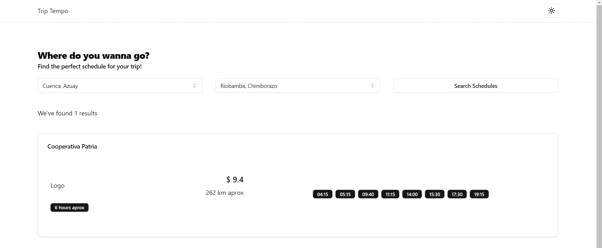

# Trip Tempo App

This project presents an application that allows the user to consult Cooperative schedules between different cities in Ecuador, the application shows the available schedules of the different cooperatives between two cities.

## Installation

This is a [Next.js](https://nextjs.org/) project bootstrapped with [`create-next-app`](https://github.com/vercel/next.js/tree/canary/packages/create-next-app).

Clone this repository

```bash
git clone https://github.com/baguilar6174/next-triptempo-app.git
```

Install dependencies

```bash
yarn
```

## Running the app

- Run `yarn dev`
- If your want to create build production, run `yarn build`

## My process

### Built with

- Next JS
- Typescript
- Eslint & Prettier
- Zustand
- Tailwind CSS
- Axios
- React Hook Form
- shadcn/ui

## Development Features

-

## Improves

- Include maps (routes)
- Include offices and terminals locations
- Trasnportation model car (seats, etc)
- Offices schedules
- Routes stops (cities without buses terminals)
- Round trip (round trip)
- Find option closest to the current time.
- Variable price

## TODO:

- Define an schema to control errors and success data fron API

## Trip Tempo App

<table>
  <tr>
    <td align="center" valign="center"></td>
    <td align="center" valign="center"></td>
  </tr>
</table>

## Stay in touch

- Website - [www.bryan-aguilar.com](https://www.bryan-aguilar.com/)
- Medium - [baguilar6174](https://baguilar6174.medium.com/)
- LinkeIn - [baguilar6174](https://www.linkedin.com/in/baguilar6174)
